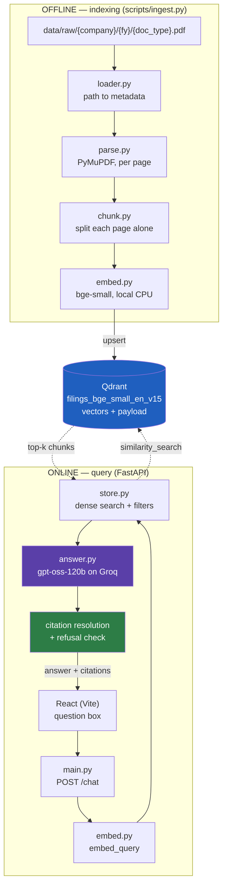
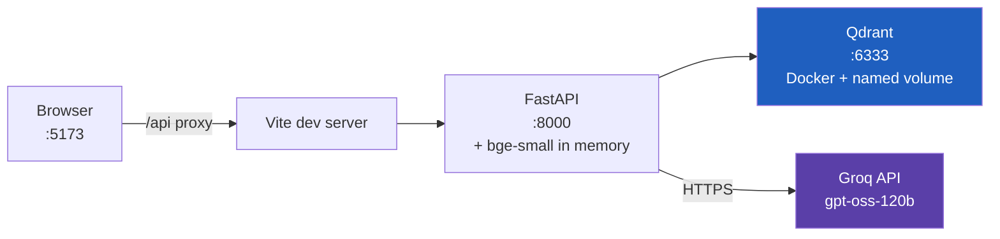
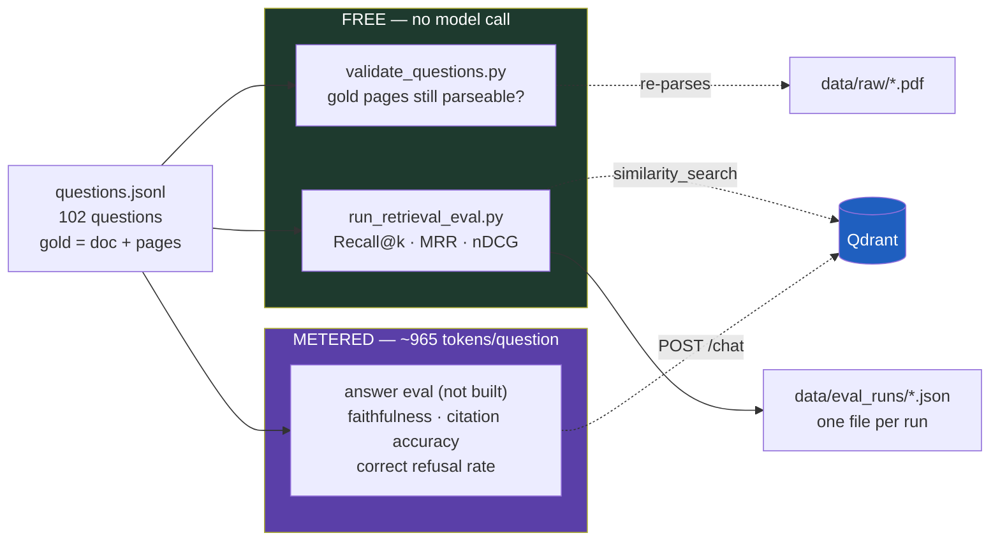

# Architecture

Component-level view of FilingsIQ at **Phase 1**. For the reasoning behind these
choices see [Thought Process](THOUGHT_PROCESS.md); for the step-by-step data path
see [Technical Flow](TECHNICAL_FLOW.md).

---

## System overview

Two pipelines that share only the vector store. Indexing runs offline and
occasionally; querying runs online per request.



The dotted lines are the only coupling between the two pipelines. That is
deliberate: ingestion can be rewritten (Phase 3's structure-aware chunking)
without touching the query path, as long as the payload keys stay stable.

---

## Module responsibilities

Each module does one job and hands off. The `rag/` package has no knowledge of
HTTP, and `main.py` has no knowledge of PDFs.

| Module | Responsibility | Key decision it owns |
|---|---|---|
| `config.py` | Settings + embedding model registry | Ties dimension, query prefix and collection name to the model so they cannot drift |
| `schemas.py` | Pydantic contracts | `Citation` shape — what "verifiable" means concretely |
| `rag/loader.py` | Discover PDFs, derive metadata | Fails loudly on bad layout rather than skipping files |
| `rag/parse.py` | PDF to text, **per page** | Captures the page number that every citation depends on |
| `rag/chunk.py` | Split pages into embeddable units | Splits each page independently, preserving provenance |
| `rag/embed.py` | Text to vectors, locally | Applies the asymmetric query prefix in one place |
| `rag/store.py` | Qdrant index + search | Server-side metadata filtering; dimension guard |
| `rag/answer.py` | Prompt, model call, citations | Resolves `[Sn]` markers; detects refusal; rate limits |
| `main.py` | HTTP surface | Loads the model at startup, not per request |
| `eval/questions.jsonl` | 102 labelled questions | Gold is a *list* of pages — alternative correct sources, any one of which counts |
| `eval/validate_questions.py` | Guard the labels | Catches gold pages the parser drops, which would score 0 forever |
| `eval/run_retrieval_eval.py` | Recall@k, MRR, nDCG | Runs without a model call, so it is free to repeat |

---

## The provenance chain

The project's core promise — *every answer cites a document and page* — is a
chain, and it holds only if every link does. This is the most important diagram
in the repo.


Two properties worth noting:

- **The page number is never recomputed.** It is read once from the PDF and
  copied forward. Nothing downstream can derive a page, so nothing downstream
  can derive it *wrongly*.
- **The last arrow inverts the trust direction.** `build_citations` does not read
  the page from the model's text; it reads the marker, looks up the chunk that
  was actually retrieved, and takes the page from *that*. The model chooses
  *which* source to cite but never *what the citation says*.

---

## Data model

### On disk

```
data/raw/{company}/{fiscal_year}/{doc_type}.pdf     # path IS the metadata
data/manifest.csv                                    # what a path cannot express
```

`doc_type` is a closed set (`annual_report`, `quarterly_results`,
`earnings_call`) so a typo becomes an ingestion error rather than a phantom
document type no filter will ever match.

### In Qdrant

One point per chunk: a vector plus a payload. The payload keys are a **contract**
between `chunk.py`, the Qdrant filters, and `Citation`:

| Key | Role |
|---|---|
| `company`, `fiscal_year`, `doc_type` | Retrieval filters **and** citation display |
| `page` | Citation target (1-based, as a PDF reader shows it) |
| `source_path` | Locates the PDF; Phase 6 opens it at `page` |
| `company_name`, `sector`, `source_url` | From the manifest; display and traceability |
| `chunk_index` | Debugging only — position within its page |

Renaming any of the first four means updating `chunk.py`, `store.build_filter`,
`schemas.Citation`, **and re-indexing**.

---

## Infrastructure



Only one process holds state: Qdrant, on a named Docker volume that survives
`docker compose down`. The API is stateless apart from the embedding model it
loads at startup — which is why startup is slow and requests are fast.

**A deployment consequence:** the embedding model lives *inside* the API process.
`bge-small` needs modest memory; `bge-m3` holds roughly 2.2 GB of weights. During
development the API process was killed by the OS under memory pressure while
running the *small* model, so a VPS sized for Phase 7 needs real headroom — or
embeddings need to move to their own service.

---

## The evaluation loop (Phase 2)

A third pipeline, and the reason it is drawn separately is that it splits at the
point where cost appears. Everything left of the dashed line is free and can run
on every change; everything right of it spends from a 200K tokens/day budget.



**Why the split is structural rather than a flag.** Retrieval metrics need only
the question and its gold pages, so they cost nothing and can run on every
chunking or embedding change — which is the loop Phase 3 lives in. Answer
metrics need a generation per question, so a full pass is roughly half a day's
token budget. Merged into one runner, measuring a chunking change would cost the
same as measuring answer quality, and Phase 3 would get about two experiments a
day.

**What `validate_questions.py` guards.** A gold page that `parse.py` discards
(under `MIN_PAGE_CHARS`) is not in the index, so no retriever can ever return
it. The question then scores 0 forever and reads as a retrieval failure rather
than a labelling mistake. The validator re-parses the PDFs and fails loudly on
exactly that — it is the same "fail loudly on data problems" convention as
`CorpusLayoutError` and `IndexMismatchError`, applied to the eval's own data.

**Why runs are written to `data/eval_runs/`, not just printed.** The success
criterion in [project.md](../project.md) is a baseline-versus-final metrics
table, which requires runs to be comparable months apart. Each file records the
embedding model, collection, chunk size and overlap alongside the scores,
because a recall change means nothing if the index underneath it also changed.
These files are committed — they are the evidence for every number in the
README. At ~108 KB per run they will need pruning eventually; the per-question
`retrieved` lists are the bulk and are what makes a regression diagnosable.

---

## What is deliberately absent

Phase 1 has no Postgres, Redis, Celery, LangGraph, reranker, BM25 index, or
streaming. Each is scheduled ([roadmap](../README.md#roadmap)) and each is
absent for the same reason: it would be an unmeasured addition to a system with
no baseline.

The one structural accommodation made for the future is Qdrant, chosen partly
because it stores sparse vectors natively — so Phase 3's hybrid retrieval is an
extension rather than a migration.
